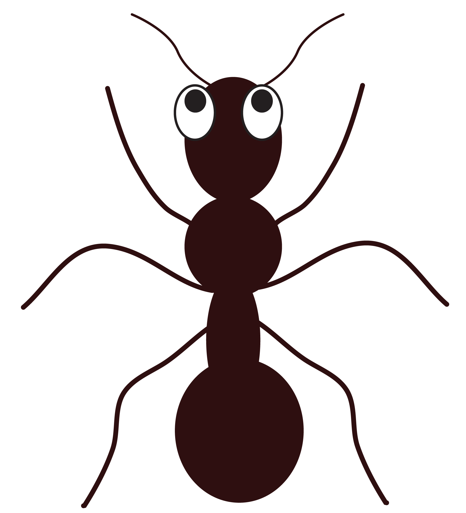

 # lem-in 

This project is meant to make code a digital version of an ant farm.

This project is a program lem-in that will read from a file (describing the ants and the colony) given in the arguments.

Upon successfully finding the quickest path, lem-in will display the content of the file passed as argument and each move the ants make from room to room.

## How does it work?

First we go to check if file is valid (directory "pkg" file "input_checker.go"),if it's valid we go to check all path finder(directory "pkg" file "pathFinder.go") and filter the best path that have no collision(directory "pkg" file "filterpath.go"). The end we go to dispatch ants in order the anthill and take the move ants(directory "pkg" file "simulator.go").

## How does it use?

go run main.go inputs/example00.txt     